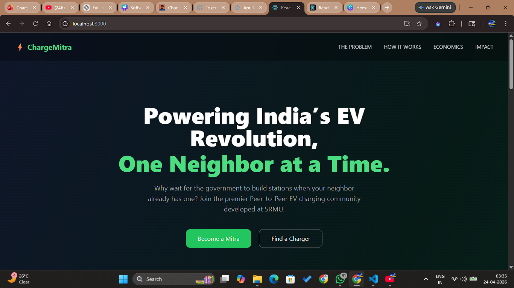
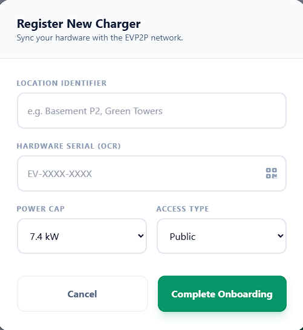
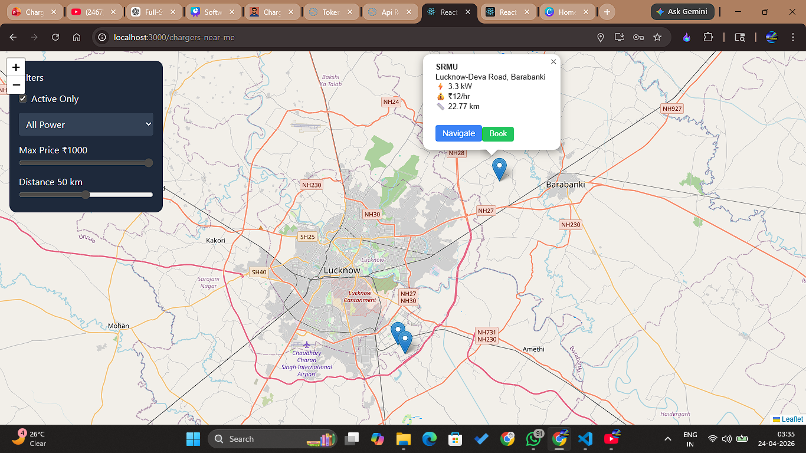
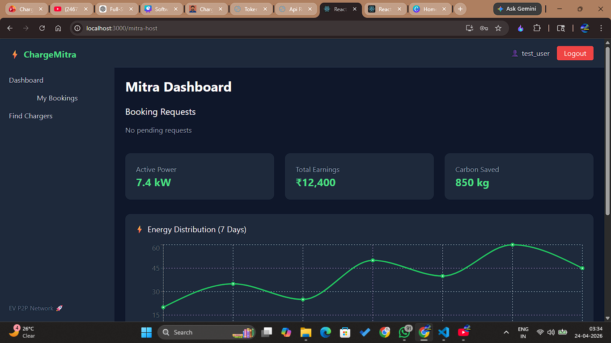
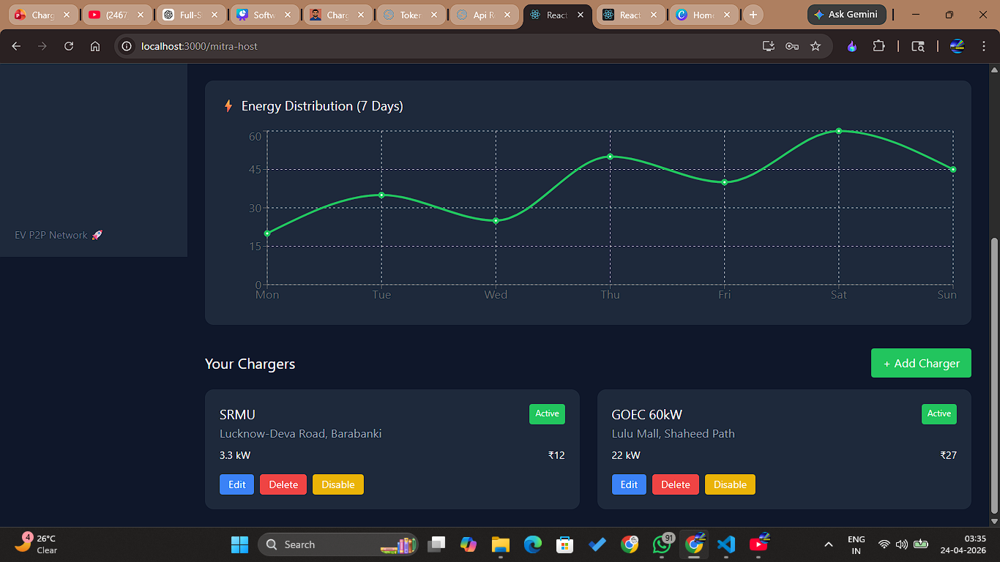
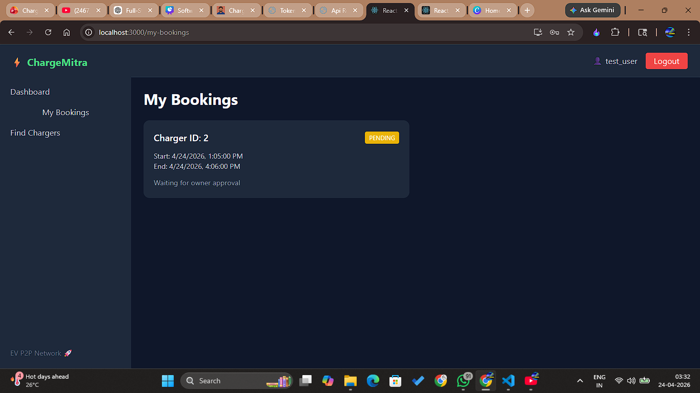
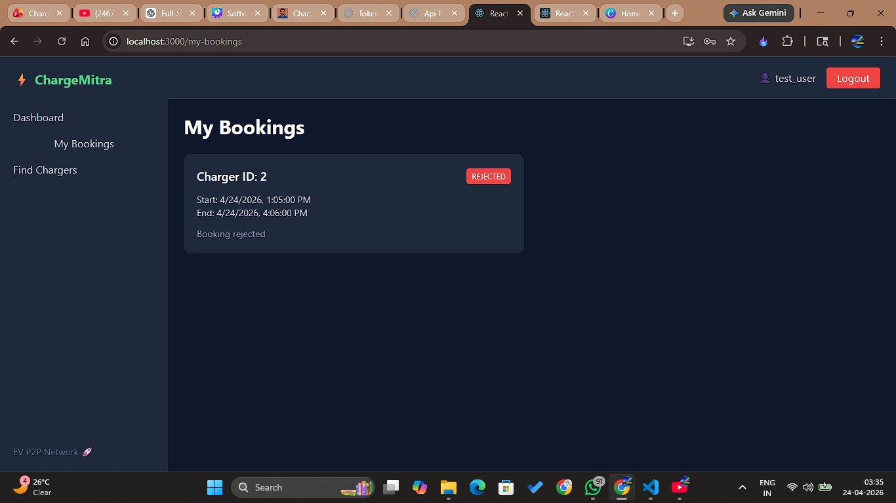

!(Screenshots/ChargeMitra_logo.png)
# ⚡ ChargeMitra

> **Powering India's EV Revolution, One Neighbor at a Time**

ChargeMitra is a Peer-to-Peer (P2P) Electric Vehicle Charging Platform that connects EV owners with individuals and businesses willing to share their charging infrastructure. The platform enables charging providers ("Mitras") to publish charger availability while allowing EV users to discover, book, and manage charging sessions through a unified digital platform.

*Know more & experience a tour:*  
🌐 [Live Demo](https://utkarshpandey.com/evp2p)

---

## 🌟 Features

### 🚗 EV Users

* Search nearby charging stations
* View charger details and availability
* Book charging slots
* Manage bookings
* View charging history
* Map-based charger discovery

### 🔌 Charging Providers (Mitras)

* Register as a charging provider
* Add and manage chargers
* Define availability schedules
* Manage booking requests
* Track charger utilization
* View earnings and insights

### 🛡️ Admin Panel

* User management
* Charger management
* Platform monitoring
* Booking oversight

---

## 📸 Screenshots

### Landing Page



### Mitra Login Portal


### Charger Registration



### Charger Discovery Map



### Mitra Dashboard




### Mitra Dashboard - Charger Booking Request



---

## 🏗️ System Architecture

```text
React Frontend
       │
       ▼
REST APIs (Axios)
       │
       ▼
Django REST Framework
       │
       ▼
SQLite / PostgreSQL
```

---

## 🛠️ Tech Stack

### Frontend

* React.js
* React Router
* Axios
* React Hook Form
* Tailwind CSS
* Material UI

### Backend

* Python
* Django
* Django REST Framework (DRF)

### Database

* SQLite (Development)
* PostgreSQL (Production)

### Tools

* Git & GitHub
* Visual Studio Code
* Postman

---

## 📂 Project Structure

```text
version2/
│
├── backend/
│   ├── api/
│   ├── chargemitra/
│   ├── requirements.txt
│   ├── manage.py
│   └── venv/
│
├── frontend/
│   ├── public/
│   ├── src/
│   ├── package.json
│   └── package-lock.json
│
├── screenshots/
│   ├── landing-page.png
│   ├── mitra-login.png
│   ├── charger-registration.png
│   ├── charger-discovery.png
│   └── mitra-dashboard.png
│
├── .gitignore
└── README.md
```

---

## 🚀 Getting Started

### Clone Repository

```bash
git clone https://github.com/UraniumUtkarsh/ChargeMitra_Version2.git
cd ChargeMitra
```

---

## ⚙️ Backend Setup

```bash
cd backend

python -m venv venv

# Windows
venv\Scripts\activate

# Install dependencies
pip install -r requirements.txt

# Run migrations
python manage.py migrate

# Start server
python manage.py runserver
```

Backend will run at:

```text
http://127.0.0.1:8000
```

---

## 💻 Frontend Setup

```bash
cd frontend

npm install

npm start
```

Frontend will run at:

```text
http://localhost:3000
```

---

## 🔌 API Modules

### Authentication

```http
POST /api/auth/login/
POST /api/auth/logout/
```

### Users

```http
GET    /api/users/
POST   /api/users/
GET    /api/users/{id}/
PUT    /api/users/{id}/
DELETE /api/users/{id}/
```

### Chargers

```http
GET    /api/chargers/
POST   /api/chargers/
PUT    /api/chargers/{id}/
DELETE /api/chargers/{id}/
```

### Bookings

```http
GET    /api/bookings/
POST   /api/bookings/
PUT    /api/bookings/{id}/
DELETE /api/bookings/{id}/
```

---

## 🔄 Workflow

1. User Registration/Login
2. Search Nearby Chargers
3. View Charger Availability
4. Select Charging Slot
5. Confirm Booking
6. Visit Charging Location
7. Complete Charging Session
8. Booking Data Stored

---

## 🌱 Sustainability Goals

ChargeMitra promotes sustainable transportation through:

* Improved EV accessibility
* Community-driven charging infrastructure
* Efficient utilization of existing electrical resources
* Carbon emission awareness
* Future carbon credit integration

---

## 🔮 Future Scope

* Real-time charger availability
* Live location tracking
* Payment gateway integration
* IoT-enabled charger monitoring
* Blockchain-based energy transactions
* Carbon credit marketplace
* AI-powered demand prediction
* Smart pricing system
* Mobile application

---

## 👨‍💻 Author

- **Utkarsh Pandey** – Full-Stack Developer
  🔗 https://www.linkedin.com/in/uranium-utkarsh-pandey/


## 📜 License

This project is developed for academic, research, and educational purposes.

---

<p align="center">
  <strong>⚡ Powering India's EV Revolution, One Neighbor at a Time ⚡</strong>
</p>
